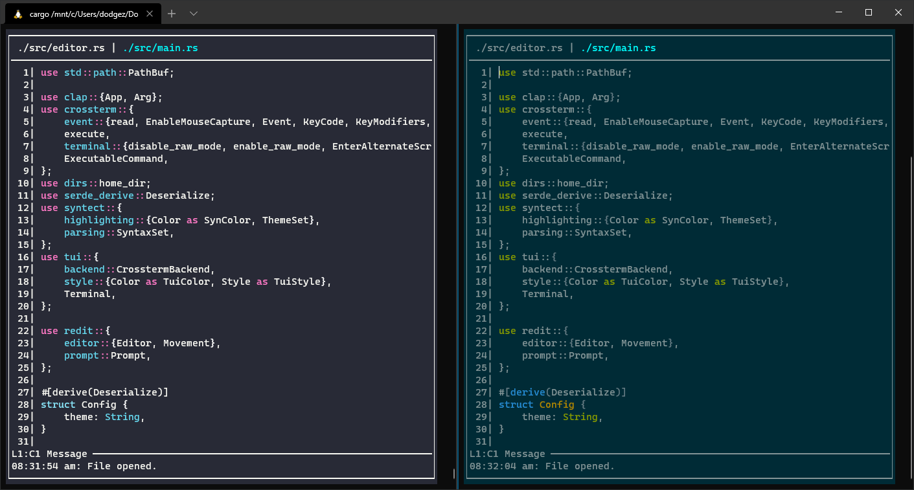

# redit
A simple text editor written in rust.

Redit opened in Windows and Linux (WSL) showing the Dracula theme (separate) and the default Solarized dark theme.

## Features
- Terminal listens to resize events
- Page Up/Down, Home/End, Arrow, and Ctrl-Arrow key navigation
- Select text with Shift
- Multiple file buffers
- Copy and Paste (not yet using system clipboard)
- Highlight selected text
- Syntax highlighting
- Mouse support (dependent on terminal emulator)
- Undo and redo history
- Command palette (see section below for a list of commands)

### In-Progress
Roughly listed in order of priority:
- Directory opening (medium)
- Search (hard)
- Better Ctrl-Arrow key navigation (medium)
- Ask to reload file when changed on disk (hard)
- Copy and paste using system clipboard

## Key-Bindings
- `Ctrl-q` - quits the current editor (or program when in last editor)
- `Ctrl-r` - reloads the current file from disk
- `Ctrl-s` - saves the currently open file (or asks where to save new file)
- `Ctrl-o` - opens a file
- `Ctrl-c`, `Ctrl-x`, `Ctrl-v` - copy, cut, and paste respectively (works across editor buffers)
- `Ctrl-p` or `Ctrl-n` - switch to the previous or next editor respectively
- `Ctrl-b` - creates a new editor
- `Home` or `End` - moves to the beginning or end of the current line
- `PageUp` or `PageDown` - moves (up to) one screen height up or down
- `Backspace` or `Delete` - deletes the character directly behind or in front of the cursor
- `Enter` - creates a line break by copying the line break at the end of the current line
- `Escape` - exits the prompt (e.g. saving/opening a file) when active
- Anything other than characters is currently ignored (note: doesn't even refresh editor)

## Command Palette
The following commands are implemented:
- `save [file_path]` - Saves the current file as `file_path`
- `open [file_path]` - Opens `file_path` in the current editor
